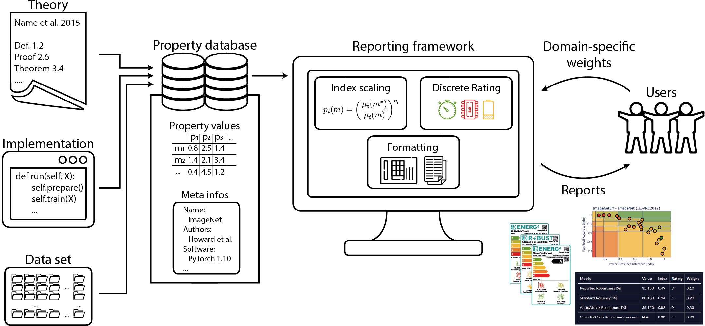

# STREP - Sustainable and Trustworthy Reporting for ML

**You are on the frozen "paper" branch. We continue enhancing our STREP software on other branches. To be consistent, this is the state of the repository when the paper was accepted and published.**

Software repository for more sustainable and trustworthy reporting of ML results - associated research paper published in [Data Mining and Knowledge Discovery](https://link.springer.com/article/10.1007/s10618-024-01020-3). To investigate the results you can use our publicly available [Exploration tool](http://167.99.254.41/), so no code needs to be run on your machine (note that it might not be the most current version, we are working on updating it automatically with changes to this repository).

## Installation
Simply install required packages via `pip install -r requirements.txt` (tested on Python 3.10).

## Usage
Run `main.py` to process and ivnestigate the pre-assembled databases (startup will take some time).
If you want to explore your own database, simply pass the path to the pickled `pandas` dataframe via `main.py --database [path/to/your/database.pkl]`.
If you want to also process meta information with STREP, just include `json` files in the database directory - make sure to follow our convention as given in the pre-assembled database directories (documentation to follow).

## Repository Structure
The `databases` directory contains different gathered databases of ML reports, including scripts to assemble some of them.
`strep` contains code that processes these databases, calculates index values and compound scores for measurements, and visualizes them.
All `paper_results` can be found in the respective folder, and can be re-generated with the corresponding script.
`parse_logs.py` allows to generate a database file from multiple log directories (documentation to follow).

## Terms of Use
Copyright (c) 2024 Raphael Fischer