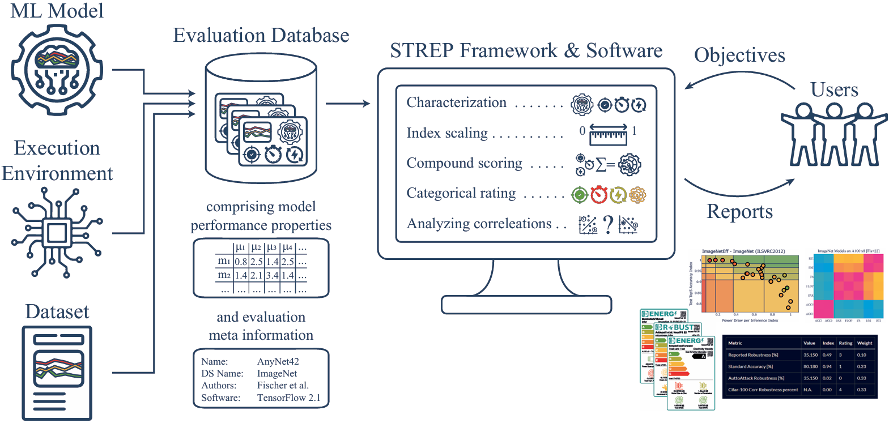

# STREP - Sustainable and Trustworthy Reporting for ML

Software repository for more **sustainable and trustworthy reporting of machine learning results** - associated research paper published in [Data Mining and Knowledge Discovery (open access)](https://link.springer.com/article/10.1007/s10618-024-01020-3). With our publicly available [Exploration tool](https://strep.onrender.com), you can investigate all results - no code needs to run on your machine!



Note that we continue to advance our software - it is work in progress and subject to change, so you might encounter delays, off-times, and slight differences to our paper. Check out the [paper branch](https://github.com/raphischer/strep/tree/paper) for a frozen state of the software when the paper was published.

## Explore your own databases
Instead of exploring the pre-assembled databases, you can also investigate your own custom results by following these steps:
1. Prepare your database as a `pandas` DataFrame (each row lists one model performance result on some data set, with different measures as columns). 
2. Store it in a directory, optionally add some `JSON` meta information (check our databases folder for examples and follow these naming conventions).
3. Clone the repo and install necessary libraries via `pip install -r requirements.txt` (tested on Python 3.10).
4. Either run `python main.py --custom path/to/database.pkl`, or use the following code snippet:
```python
from strep.index_scale import load_database, scale_and_rate
from strep.elex.app import Visualization

fname = 'path/to/your/database.pkl'
# load database and meta information (if available)
database, meta = load_database(fname)
# index-scale and rate database
rated_database = scale_and_rate(database, meta)
# start the interactive exploration tool
app = Visualization(rated_database)
app.run_server()
```

## News and Release History
- **17 April 2025** - Some changes and lots of new figures, to be found in my PhD thesis (just submitted)
- **13 January 2025** - Many fixes, (re-)added [Papers with Code](https://paperswithcode.com/) and [EdgeAccUSB](https://github.com/raphischer/edge-acc) databases
- **2 October 2024** - Greatly improved index scaling (x15 speed), added / updated result databases from [MetaQuRe](https://github.com/raphischer/metaqure) and [AutoXPCR](https://github.com/raphischer/xpcr) (Forecasting)
- **11 September 2024** - Presented our paper and repository at ECML-PKDD '24
- **16 August 2024** - Merged a lot of functionality that was developed for other works
- **30 April 2024** - paper published in [Data Mining and Knowledge Discovery (open access)](https://link.springer.com/article/10.1007/s10618-024-01020-3), alongside the initial verison of this repository

## Contributing
We firmly believe that reporting in a more sustainable and trustworthy fashion is a **community effort**. 
If you perform large-scale benchmark experiments, stress-test a lot of models or have any other important things to report - **get in touch!** Our contact info is given in our papers.
We would love to showcase other resource-aware reports here. If you send us your own performance databases, we will gladly add them and highlight your work as a significant contribution.

### Current available databases:
- [ImageNetEff22 (Fischer et al. 2022)](https://github.com/raphischer/imagenet-energy-efficiency): Efficiency information of popular ImageNet models
- [EdgeAccUSB (Staay et al. 2024)](https://github.com/raphischer/edge-acc): Efficiency results of stress-tested USB accelerators for edge inference with computer vision models
- [XPCR / Forecasting (Fischer et al. 2024)](https://github.com/raphischer/xpcr): Efficiency information of DNNs for time series forecasting tasks
- [MetaQuRe (Fischer et al. 2024)](https://github.com/raphischer/metaqure): Resource and quality information of ML algorithm performance on tabular data
- [RobustBench (Croce et al. 2020)](https://robustbench.github.io/): Robustness and quality information of image classification models
- [Papers With Code](https://paperswithcode.com/): The most popular benchmarks from this public database (code for re-assembling can be found [here](./databases/paperswithcode))

## Citing

If you appreciate our work and code, please cite [our paper](https://doi.org/10.1007/s10618-024-01020-3) as given by Springer:

Fischer, R., Liebig, T. & Morik, K. Towards more sustainable and trustworthy reporting in machine learning. Data Min Knowl Disc 38, 1909–1928 (2024). https://doi.org/10.1007/s10618-024-01020-3

or using the bibkey below:

```
@article{fischer_towards_2024,
	title = {Towards more sustainable and trustworthy reporting in machine learning},
	volume = {38},
	issn = {1573-756X},
	url = {https://doi.org/10.1007/s10618-024-01020-3},
	doi = {10.1007/s10618-024-01020-3},
	number = {4},
	journal = {Data Mining and Knowledge Discovery},
	author = {Fischer, Raphael and Liebig, Thomas and Morik, Katharina},
	month = jul,
	year = {2024},
	pages = {1909--1928},
}
```

## Repository Structure
- `databases` contain different gathered evaluation databases of ML reports, including scripts to assemble some of them.
- `strep` contains software that processes the databases, calculates index values and compound scores, and visualizes them.
- `materials` contains some additional data, scripts, and figures used in papers and my PhD thesis.
- The top level scripts are used to deploy the exploration tool on [render](https://dashboard.render.com/), and a main script for running it locally.

## Terms of Use
Copyright (c) 2025 Raphael Fischer