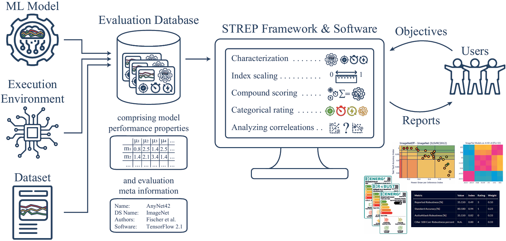

# STREP - Sustainable and Trustworthy Reporting for ML and AI

Software for **sustainable and trustworthy reporting** in machine learning and artificial intelligence, as proposed in my [PhD thesis](https://doi.org/10.17877/DE290R-25716) and original [research paper](https://doi.org/10.1007/s10618-024-01020-3). With the publicly hosted [Exploration tool](https://strep.lamarr.tu-dortmund.de/), you can investigate evaluation databases - no code needs to run on your machine!



Note that this software is under active development - it reflects work in progress and is subject to change, so you might encounter delays, off-times, and differences to earlier publications. Check out the [paper branch](https://github.com/raphischer/strep/tree/paper) and [dissertation branch](https://github.com/raphischer/strep/tree/diss) for frozen states at the respective time of publication.

## News and Release History
- **23/01/2026** - Now on [PyPI](https://pypi.org/project/strep/0.0.1/), so you can finally run `pip install strep` (use `strep[frontend]` for labeling and exploration)
- **22/09/2025** - Published my [PhD thesis](https://doi.org/10.17877/DE290R-25716) based on STREP
- **17/04/2025** - Some changes and lots of new figures, soon to be found in my PhD thesis
- **13/01/2025** - Many fixes, updated [Papers with Code](https://paperswithcode.com/) and [EdgeAccUSB](https://github.com/raphischer/edge-acc) databases
- **02/10/2024** - Improved scaling code (x15 speed), updated [MetaQuRe](https://github.com/raphischer/metaqure) and [AutoXPCR](https://github.com/raphischer/xpcr) databases
- **11/09/2024** - Improved functionality and presented the work at ECML-PKDD '24
- **30/04/2024** - Paper published in [Data Mining and Knowledge Discovery](https://link.springer.com/article/10.1007/s10618-024-01020-3), alongside initial repository

## Explore your own databases
Instead of exploring the pre-assembled databases, you can also investigate your own custom evaluations by following these steps:
1. Prepare an evaluation database as a `pandas` DataFrame OR use [mlflow experiments csv](https://mlflow.org/docs/latest/api_reference/cli.html#mlflow-experiments-csv) export to create a `csv` file with your ML experiment runs (each row should list one model performance evaluation on some data set)
2. Store the pickled database or `csv` summary in any directory, and optionally add some `JSON` meta information (check our [databases](https://github.com/raphischer/strep/tree/main/databases) for examples).
3. Install the complete STREP functionaility by running `pip install strep[frontend]` (Python 3.8 - 3.12).
4. Run the following code snippet:
```python
from strep.index_scale import load_database, scale_and_rate
from strep.elex.app import Visualization

fname = 'path/to/your/database.pkl' # or .csv summary
# load database and meta information (if available)
database, meta = load_database(fname)
# index-scale and rate database
rated_database = scale_and_rate(database, meta)
# start the interactive exploration tool
app = Visualization(rated_database)
app.run()
```

## Contributing
I firmly believe that sustainable and trustworthy reporting is a **community effort**. 
If you perform large-scale benchmark experiments, stress-test AI models, or have other interesting ML evaluations to report - [please get in touch!](https://lamarr.cs.tu-dortmund.de/team/raphael-fischer/)
I would love to include other resource-aware evaluation databases and highlight your work.

### Current available databases:
- [ImageNetEff22 (Fischer et al. 2022)](https://github.com/raphischer/imagenet-energy-efficiency): Efficiency information of popular ImageNet models
- [EdgeAccUSB (Staay et al. 2024)](https://github.com/raphischer/edge-acc): Efficiency results of stress-tested USB accelerators for edge inference with computer vision models
- [XPCR / Forecasting (Fischer et al. 2024)](https://github.com/raphischer/xpcr): Efficiency information of DNNs for time series forecasting tasks
- [MetaQuRe (Fischer et al. 2024)](https://github.com/raphischer/metaqure): Resource and quality information of ML algorithm performance on tabular data
- [RobustBench (Croce et al. 2020)](https://robustbench.github.io/): Robustness and quality information of image classification models
- [Papers With Code](https://paperswithcode.com/): The most popular benchmarks from this public database (code for re-assembling can be found [here](https://github.com/raphischer/strep/databases/paperswithcode))

## Citing

If you appreciate our work and code, please cite my [PhD thesis](https://doi.org/10.17877/DE290R-25716) and original [research paper](https://doi.org/10.1007/s10618-024-01020-3):

```
Fischer, R. Advancing the Sustainability of Machine Learning and Artificial Intelligence via Labeling and Meta-Learning.
Ph.D. Dissertation, TU Dortmund University (2025). https://doi.org/10.17877/DE290R-25716

Fischer, R., Liebig, T. & Morik, K. Towards More Sustainable and Trustworthy Reporting in Machine Learning. Data Mining and Knowledge Discovery 38, 1909–1928 (2024). https://doi.org/10.1007/s10618-024-01020-3
```

You can use the following bibtext entries:

```bibtex
@phdthesis{fischer_diss,
  title={Advancing the Sustainability of Machine Learning and Artificial Intelligence via Labeling and Meta-Learning},
  author={Fischer, Raphael},
  school={TU Dortmund University},
  url={http://doi.org/10.17877/DE290R-25716},
  doi={10.17877/DE290R-25716},
  year={2025}
}
```

```bibtex
@article{fischer_strep,
	title = {Towards More Sustainable and Trustworthy Reporting in Machine Learning},
	volume = {38},
	issn = {1573-756X},
	url = {https://doi.org/10.1007/s10618-024-01020-3},
	doi = {10.1007/s10618-024-01020-3},
	number = {4},
	journal = {Data Mining and Knowledge Discovery},
	author = {Fischer, Raphael and Liebig, Thomas and Morik, Katharina},
	year = {2024},
	pages = {1909--1928},
}
```

## Repository Structure
- `databases` contains different gathered evaluation databases of ML reports, including scripts to assemble some of them.
- `src/strep` contains software that processes the databases, calculates index values and compound scores, and visualizes them.
- `materials` contains some additional data, scripts, and figures used in papers and my thesis.
- The top level files and scripts are used for building and deploying the software.

## Terms of Use
Copyright (c) 2026 Raphael Fischer
